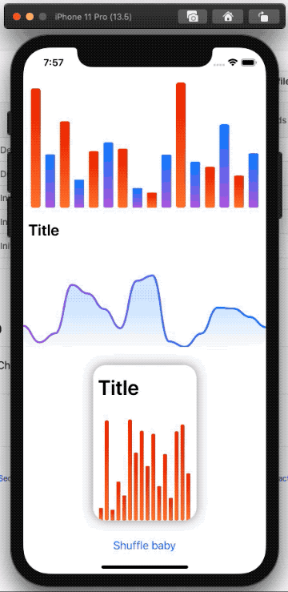

# ChartViewV2Demo
Demo code for the upcoming SwiftUI ChartView v2 release

In V2 a new structure is introduced. With this you will be able to create your charts with more modularity.



## Creating a basic chart

You can create 
* barchart
* linechart
* piechart

To create a chart, initialise the chart type you would like to have then give it data and style: 
```swift
@State var chartData: [Double] = [0, 5, 6, 2, 13, 4, 3, 6]

BarChart()
.data(chartData)
.style(ChartStyle(...))
```

## Creating a cardview chart

To create a cardview chart, you just embed a basic chart in a CardView element, also cardview is a normal view now, so you can specify your frame if you like:

```swift
CardView {
  ChartLabel("Title", type: .title)
  BarChart()
}
.data(chartData)
.style(ChartStyle(...))
```

or 

```swift
CardView {
  BarChart()
  ChartLabel("Text", type: .custom(...))
}
.data(chartData)
.style(ChartStyle(...))
```

## Adding a title, subtitle or custom text

Title, subtitle and text is now a standalone element, called `ChartLabel`. When you interact with the chart, the current chart value will automatically appear in place of the text in ChartLabel. You can add a ChartLabel by inserting above or below the chart:

```swift
CardView {
  BarChart()
}
.data(chartData)
.style(ChartStyle(...))
.frame(width: 160, height: 240)
```

## ChartLabel

Has types: 
* `title`
* `largeTitle`
* `subtitle`
* `legend`
* `custom(size: CGFloat, padding: EdgeInsets, color: Color)`

## ChartStyle

ChartStyle contains as for now the backgournd and foreground color. Foreground color property is a array so you can have multiple colors in some charts.
Colors are a type of ColorGradient so it supports linear grandients and simple colors too.

initialisers: 

* `public init(backgroundColor: Color, foregroundColor: [ColorGradient])`
* `public init(backgroundColor: Color, foregroundColor: ColorGradient)`
* `public init(backgroundColor: ColorGradient, foregroundColor: ColorGradient)`
* `public init(backgroundColor: ColorGradient, foregroundColor: [ColorGradient])`

## CardView

`public init(showShadow: Bool = true, @ViewBuilder content: @escaping () -> Content)`


